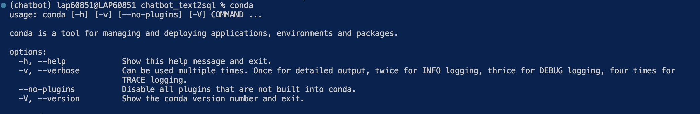

# Yue1608 AI - Modern AI Chatbot
## Setup Instructions

### Prerequisites

- Python 3.10

### Installation

1. **Clone or download the project files**
- Locate to your prefered directory, then open your terminal and clone the git repo into your local
```bash
   git clone https://github.com/bipowerhcmcity/chatbot_text2sql.git
   ```

2. **Install Python dependencies**:
    
    2.1 (Optional) Create the new Python Environment 
    - Check the conda available or not 
    ```bash
   conda 
   ```
   If it shows the message like this, this already has the conda installation. 
   

    - Create the new environment: 
    ```bash
   conda create -n chatbot python==3.10 
   ```
   - Activate the conda environment 
   ```bash
   conda activate chatbot
   ```

   - Initialize the shell interaction with the conda environment 
   ```bash
   conda init --all 
   ```

    2.2  Jumps into the git repo folder (chatbot_text2sql):
    ```bash
   cd chatbot_text2sql
   ```
    2.3 Install the Python dependencies: 
   ```bash
   pip install -r requirements.txt
   ```

3. **Set up environment variables**:
   - Go to your terminal, then type:
     ```
     export OPENAI_API_KEY="{your API key}"
     ```

4. **Run the application**:
   ```bash
   python main.py
   ```

5. **Open your browser** and navigate to:
   ```
   http://localhost:8000